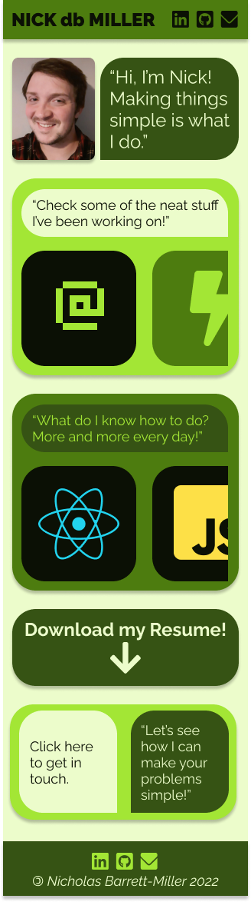
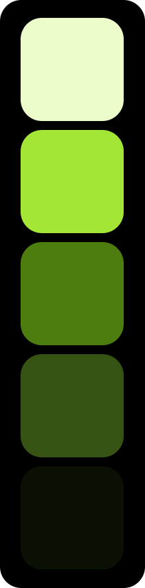
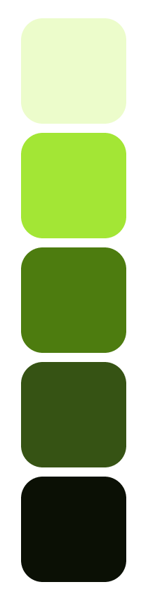

# [**Nick DB Miller's Portfolio**](https://www.nickdbmiller.com) 

## Overview
This project is a portfolio website for me, Nick db Miller. The site showcases my work as a developer. Click a link below to check out my deployed projects!

- [**Web of Rogues**](https://nickdbmiller.github.io/Web-of-Rogues-Game/)
- [**Efficient.ly**](https://builtefficiently.netlify.app/)
- [**Bored? Game!**](https://competent-noyce-c7b535.netlify.app/)
- [**Needful**](https://needfulshop.netlify.app/)

## Wireframe

### [Click here to interact with the mobile prototype!](https://www.figma.com/proto/NWPLo7KdAZocxH2CTsAqlz/Portfolio-Site?node-id=2%3A3&scaling=scale-down&page-id=0%3A1)

###### [Created with Figma](https://figma.com/) 

## Development Goals

### Minimum Viable Product (MVP)

#### General
- Simple and welcoming landing page
- Clean, on-brand theme, written with first-person language
- Easy to navigate, single page layout
- Shares some of my personality
- Highlights the value I bring to a client
- Easy for user to contact me

#### Technical
- Simple URL, representative of me with a version of my name
- Mobile, medium and large desktop screen layouts
- Sticky navebar on top with links to github, linkedin, email and links to jump between different sections
- Footer with links to github, linkedin and email
- Downloadable PDF version of my resume
- Clear, concise intro section that includes my name, professional title, and an explanation of what I do 
- Each project showcase has a photo, and a link to the github repo and the deployed app

### Post-MVP
- Use google analytics for optimization
- Ensure compatability with all browsers and screen sizes
- An arrow that appears in the lower right corner to instantly scroll back to the top
- Subtle animations
- Additional themes (Dark Mode, Colorblind Mode)

## [Change Log](https://github.com/nickdbmiller/nickdbmiller_portfolio/commits/main)
